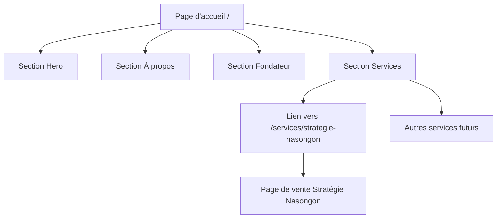

<!-- 6ca8dea5-cb2b-438e-8738-b8e3c92b1842 63532af0-057f-4659-8e0f-9669eed59822 -->
# Restructuration du site VB Sniper Académie

## Vue d'ensemble

Créer une nouvelle page d'accueil (`/`) présentant VB Sniper Académie (entreprise et fondateur) avec une section services. Déplacer la page de vente actuelle de "Stratégie Nasongon" vers `/services/strategie-nasongon`.

## Architecture



## Fichiers à créer/modifier

### 1. Nouvelle page d'accueil principale

**Fichier**: `src/app/page.tsx`

Créer une nouvelle page avec les sections suivantes (dans l'ordre) :

- **Section Hero** (style inspiré de l'image fournie) :
  - Fond sombre (noir)
  - Portrait du fondateur à droite (éclairage dramatique)
  - Texte à gauche : "Je suis" (gris foncé) + "Geoffroy Boko" (blanc, grand)
  - Logo/icône en haut à gauche
  - CTA "Mes services" ou "Découvrir"
  - Informations de contact en haut à droite (couleur accent)

- **Section Vidéo de présentation** :
  - Titre de section
  - Intégration vidéo YouTube/Vimeo (iframe)
  - Description courte de la vidéo
  - Design centré et épuré

- **Section À propos du fondateur** :
  - Photo du fondateur (format portrait)
  - Nom et titre (Fondateur & Mentor)
  - Bio détaillée (2-3 paragraphes)
  - Réalisations/Expertise (liste à puces)
  - Chiffres clés (traders accompagnés depuis 2022, etc.)

- **Section Services** :
  - Titre "Nos Services"
  - Sous-titre "Services disponibles et à venir"
  - Grille de cartes de services :
    - **Services disponibles** : "Stratégie Nasongon" (avec badge "Disponible")
    - **Services à venir** : Autres services (avec badge "Bientôt disponible")
  - Chaque carte : Image, titre, description courte, prix (si disponible), bouton "Découvrir"
  - Lien vers `/services/strategie-nasongon` pour le service disponible

- **Section Témoignages** :
  - Titre "Ce que disent nos traders"
  - Grille de screenshots de témoignages
  - Utiliser les images existantes dans `/public/images/` (IMG-20251213-WA0002.jpg, etc.)
  - Lightbox ou modal pour voir les témoignages en grand
  - Design responsive (carrousel sur mobile, grille sur desktop)

**Structure de données pour les services** :

```typescript
type Service = {
  id: string;
  name: string;
  slug: string;
  description: string;
  cover: string;
  price?: number;
  featured?: boolean;
};
```

### 2. Déplacer la page de vente actuelle

**Fichier**: `src/app/services/strategie-nasongon/page.tsx`

- Déplacer tout le contenu actuel de `src/app/page.tsx` vers ce nouveau fichier
- Conserver toute la logique de paiement et d'authentification
- Adapter les liens internes si nécessaire
- Mettre à jour les métadonnées de la page

### 3. Créer un composant réutilisable pour les services

**Fichier**: `src/components/ServiceCard.tsx` (à créer)

Composant pour afficher une carte de service dans la section services :

- Image de couverture
- Titre et description
- Prix (si disponible)
- Bouton "Découvrir" ou "En savoir plus"
- Lien vers la page du service

### 4. Mettre à jour les métadonnées

**Fichier**: `src/app/layout.tsx`

- Mettre à jour le titre et la description pour refléter la nouvelle page d'accueil
- Adapter les métadonnées Open Graph et Twitter

**Fichier**: `src/app/services/strategie-nasongon/page.tsx`

- Ajouter des métadonnées spécifiques pour la page Stratégie Nasongon

### 5. Navigation (optionnel)

**Fichier**: `src/components/Navigation.tsx` (à créer si nécessaire)

Si une navigation globale est souhaitée :

- Logo VB Sniper Académie
- Liens : Accueil, Services, À propos, Contact
- Menu utilisateur (si connecté)

## Structure des données

### Informations entreprise (à définir)

```typescript
const companyInfo = {
  name: "VB Sniper Académie",
  description: "À travers mes divers programmes de formation et de coaching, j'accompagne des traders particuliers depuis 2022.",
  founded: 2022,
  mission: "...",
  vision: "...",
  stats: {
    tradersAccompanied: "...",
    successRate: "...",
    // etc.
  }
};
```

### Informations fondateur (à définir)

```typescript
const founderInfo = {
  name: "Geoffroy Boko", // À confirmer
  title: "Fondateur & Mentor",
  photo: "/images/founder.jpg", // À ajouter
  bio: "...", // Bio courte
  expertise: ["Trading", "Formation", "Coaching"],
  achievements: ["..."],
};
```

### Liste des services

```typescript
const services: Service[] = [
  {
    id: "strategie-nasongon",
    name: "Stratégie Nasongon",
    slug: "strategie-nasongon",
    description: "5 vidéos pour apprendre ma nouvelle stratégie nasongon",
    cover: "/images/3.jpg",
    price: 27500,
    featured: true,
  },
  // Autres services à ajouter
];
```

## Design et style

- Réutiliser le système de design existant (couleurs, typographie)
- Utiliser les classes Tailwind déjà définies
- Maintenir la cohérence visuelle avec le reste du site
- Design responsive (mobile-first)

## Étapes d'implémentation

1. **Créer la structure de dossiers** : `src/app/services/strategie-nasongon/`
2. **Déplacer le contenu actuel** : Copier `src/app/page.tsx` vers `src/app/services/strategie-nasongon/page.tsx`
3. **Créer le composant ServiceCard** : `src/components/ServiceCard.tsx`
4. **Créer la nouvelle page d'accueil** : Réécrire `src/app/page.tsx` avec les nouvelles sections
5. **Mettre à jour les métadonnées** : Dans `layout.tsx` et la nouvelle page de service
6. **Tester les redirections** : Vérifier que tous les liens fonctionnent
7. **Vérifier le SEO** : S'assurer que les métadonnées sont correctes

## Points d'attention

- **Conserver la logique de paiement** : S'assurer que le déplacement de la page ne casse pas le flux de paiement Orange Money
- **URLs existantes** : Vérifier si des liens externes pointent vers `/` et les mettre à jour si nécessaire
- **Authentification** : La logique d'auth doit continuer à fonctionner sur la nouvelle page de service
- **Images** : S'assurer que toutes les images sont accessibles depuis la nouvelle structure

## Contenu à fournir

Avant l'implémentation, il faudra :

- Les informations complètes sur l'entreprise (mission, vision, chiffres)
- Les informations sur le fondateur (nom complet, bio, photo)
- La liste complète des services (actuels et futurs)
- Les images nécessaires (photo du fondateur, etc.)